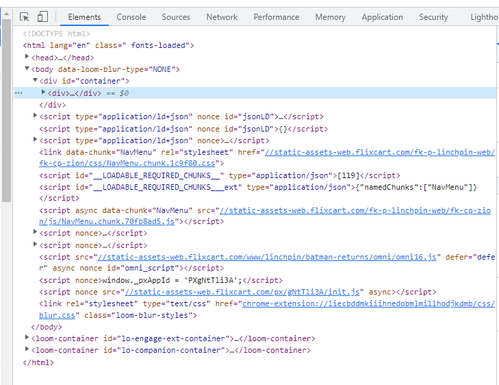
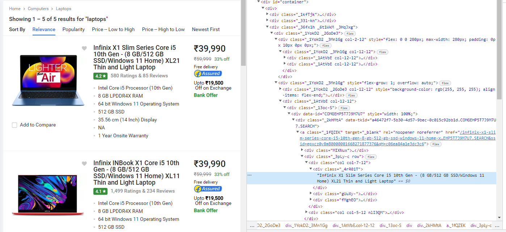

# Fetching Web Data

Python can fetch data from the web. The requests library makes it easier. In
this exercise, you'll practice making web requests using the library, and
handling the data. 

## Your Task - Basic Web Scraper
Web scraping is a technique to pull data from a website automatically to save huge amount of time and effort. Web scraping examples could be:
- Generate a list of products
- Price comparison

In this project, You will take two example webpages from two different e-commerce and shopping marketplaces; **Flipkart** and **Amazon**. You will apply a similar filter to both sites and fetch a list of products from resulting webpages.

### Filter
We will apply a `Laptop` filter as follows:
- Brand: Lenovo
- Price Range: 0 - 600$
- OS: Windows 10
- Dsiplay Size: 15 - 15.09 inches 
- Laptop weight: 1.8 - 2.3 KG
- RAM Size: 8 GB

### Procedure
Web scraping procedure can change from site to site. We will use a general procedure to pull laptop product list from **flipkart** and **Amazon** webpages after applying the mentioned filter.

General Procedure:
- Webpage Inspection
- Get Request 
- Extract Tag Information

Then, we will check what products does each website offer for the same filter.

## Steps
Let us take a closer look at the procedure, we will start with **webpage inspection** to obtain needed HTML tags, then we will check **get request** to fetch webpage data, and **extract tag information** at the end to extract information from tags.

### Webpage Inspection
Go to your browser, open this link `https://tinyurl.com/yv39w9re`, perform right mouse click and choose `inspect`. You will then see something that looks like this - raw code behind the site:



To to get to specific tag within the HTML, you need to click on the arrow symbol to start navigating through tags. When hovering the mouse on a tag, relevant webpage area will be highlighted. So in our example here, if we want to locate the tag that has the product name, we will navigate through tags till the one called `_4rR01T`:



### Get Request
As we know what tage(s) we are planning to fetch, we can then perform a get request to fetch page data:

> `response = requests.get(needed_webpage_link, headers=headers)`

headers contain web browser type and data and this request will return a response object that has many attributes and functions.

### Extract Tag Data
We will use a library called [beautiful soup](https://pypi.org/project/beautifulsoup4/) to parse HTML data to extract infomration from needed tags. Make sure to install it using `pip` and create an object as follows:

> `soup = BeautifulSoup(content, "html.parser")`
>
> `soup.findAll('<your_tag>', attrs={'<attribute_name>':'<value>'})`

`content` is the HTML code that we get back from get request while `findAll` function returns a list of all selected tags where you can then loop over to extract needed data from selected tags.

## Starter Code
Check the file called `main.py` for a starter code. You will find some import statements, function signatures, and constant values you will need to use in implementation. One important note here is the value of `headers` you may need at the request function as requested by some websites.

Header value at our example has two items, `User Agent` and `Language`. To get the correct value for your user agent:
- Open the **network** tab at the inspect page 
- Choose one request under the list **Name**
- Scroll within **Headers** tab till you find `User-Agent`.

## Testing
There are no tests for this project for now. You need to check that your code lists same product names at each selected wepage.

## Expected Results
A running example may look like the following:
```
> python main.py
Amazon Laptop Filter:

[Laptop 0]: Lenovo Ideapad 3 15.6" FHD Home and Business Laptop AMD Ryzen 5 5500U 6 Cores Integrated AMD Radeon 7 Graphics 8GB RAM DDR4 256GB SSD 82KU003NUS

[Laptop 1]: Lenovo IdeaPad 3 15ITL05 81X800ECUS 15.6" Touchscreen Notebook - HD - 1366 x 768 - Intel Core i3 i3-1115G4 Dual-core (2 Core) 3 GHz - 8 GB RAM - 256 GB SSD - Almond - Intel Chip - Windows 10 Home

[Laptop 2]: 2021 Lenovo Ideapad 3 15.6" HD Touchscreen Laptop Computer, 10th Intel Core i3-10110U Processor, 8GB DDR4 RAM, 256GB PCIe SSD, Intel UHD Graphics, Dolby Audio, HD Webcam, Win 10, Blue, 32GB USB Card

[Laptop 3]: Lenovo Ideapad 3 Laptop, 15.6 FHD Non-Touch Display, AMD Ryzen 3 3250U Processor, 8GB DDR4 RAM, 128GB PCIe NVMe SSD, Webcam, Wi-Fi, HDMI, Windows 10 Home, TWE 64GB Micro SD Card, Grey

[Laptop 4]: Lenovo IdeaPad Gaming 3-15IMH05 81Y4002NUS 15.6" Gaming Notebook - Full HD - 1920 x 1080 - Intel Core i5 10th Gen i5-10300H Quad-core (4 Core) 2.50 GHz - 8 GB RAM - 256 GB SSD - Onyx Black

Flipkart Laptop Filter:

[Laptop 0]: Lenovo Ideapad S145 Core i3 10th Gen - (8 GB/256 GB SSD/Windows 10 Home) S145-15IIL Laptop

[Laptop 1]: Lenovo Ideapad Slim 3 Core i3 10th Gen - (8 GB/512 GB SSD/Windows 11 Home) 81WE01QLIN | 81WE01QJIN Lap...

[Laptop 2]: Lenovo Ideapad S145 Ryzen 5 Quad Core 3500U - (8 GB/512 GB SSD/Windows 10 Home) S145-15API Laptop

[Laptop 3]: Lenovo IdeaPad 3 Core i3 10th Gen - (8 GB/256 GB SSD/Windows 10 Home) 15IIL05 Laptop
```

